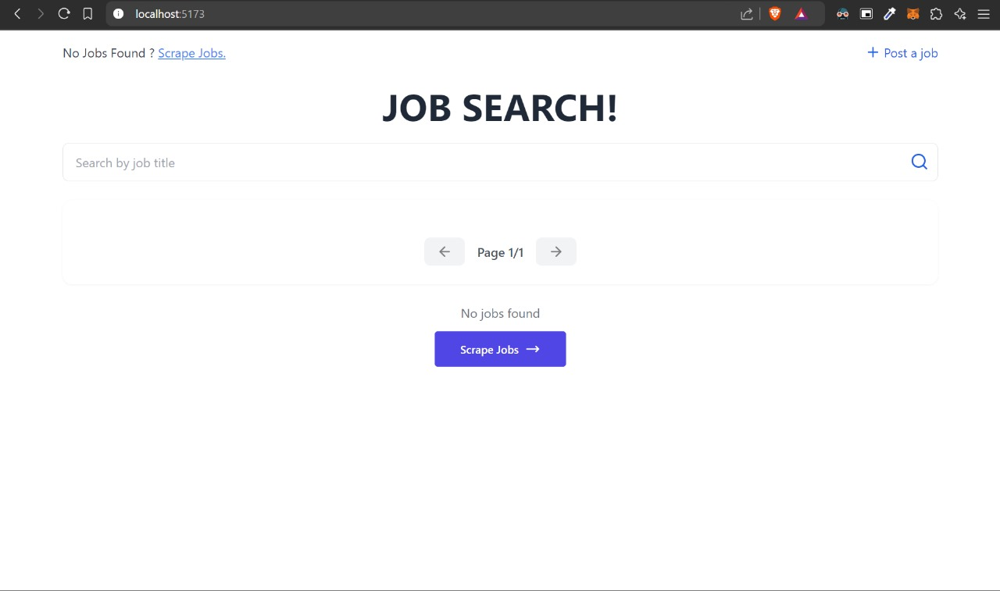
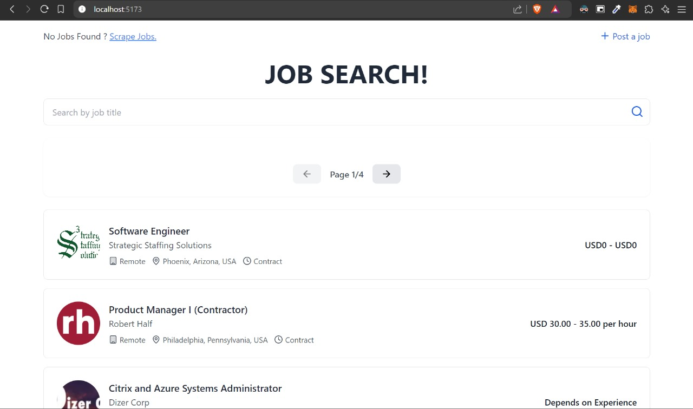
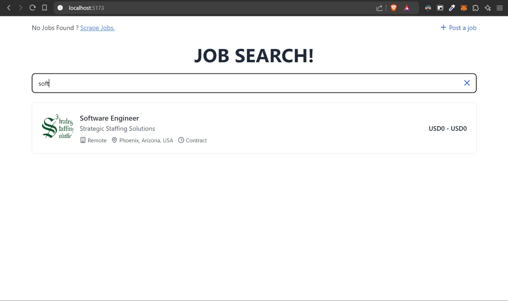
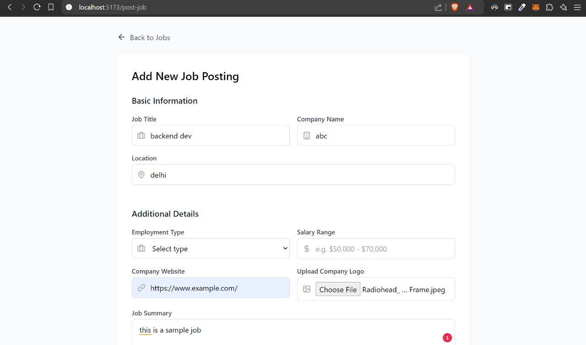
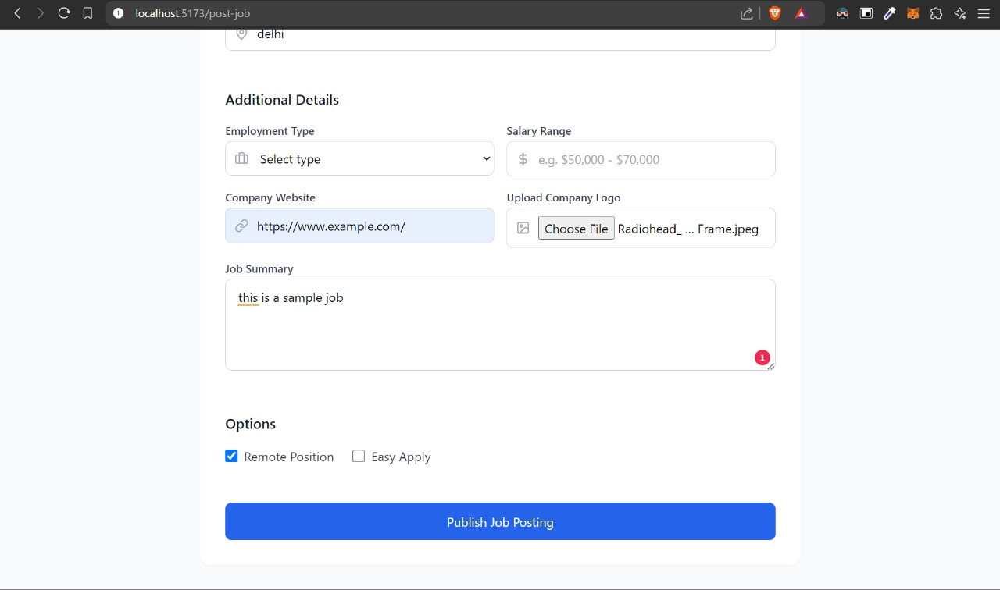
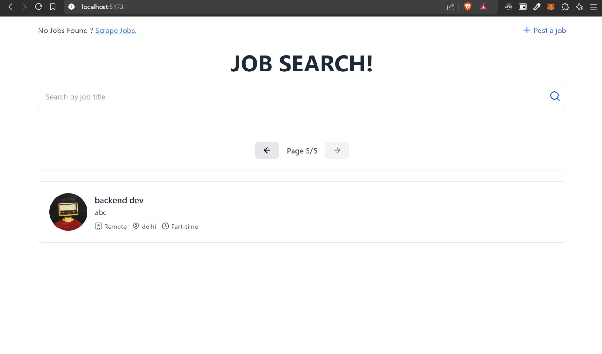

# JobSearch Application

FullStack Assignment By :
Aditya Madwal
(adityamadwal@gmail.com)

---

## Features

- **Job Search**: Search for jobs with real-time filtering.
- **Job Listing**: View job details, including title, company, location, employment type, salary, and more.
- **Pagination**: Seamless navigation between job pages.
- **Dynamic API Integration**: Fetch and scrape job data via API calls.
- **Post Job**: Allows companies to add new job postings.

---

## Tech Stack

### Frontend

- **ReactJS**: For building the dynamic user interface.
- **TailwindCSS**: For responsive and modern styling.
- **Lucide Icons**: For consistent and clean icons.

### Backend

- **Django REST Framework**: For building APIs and handling business logic.
- **SQLite**: For database storage.
- **Python**: For backend scripting and API handling.

---

## Screenshots

### Job Board





### Post a Job





---

## Usage

1. Clone the repository:

   ```bash
   git clone https://github.com/aditya-madwal/jobs_search
   cd frontend
   ```

2. Install dependencies:

   ```bash
   npm install
   ```

3. Run the frontend:

   ```bash
   npm run dev
   ```

4. Run the backend:

   - Navigate to the Django project directory.
   - Run the server:
     ```bash
     python manage.py runserver
     ```

5. Open your browser and navigate to:
   ```
   http://127.0.0.1:8000 -- backend
   http://localhost:5173 -- frontend (usable app)
   ```

---

## API Endpoints

- **GET** `/api/jobs/`: Fetch paginated jobs.
- **GET** `/api/jobs/?search=xyz`: search jobs.
- **POST** `/api/jobs/scrape/`: Scrape and add jobs dynamically.
- **POST** `/api/jobs/create/`: Add a new job listing.

---
